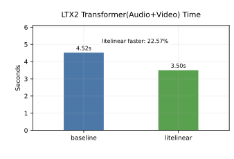
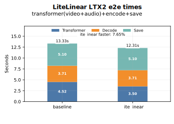
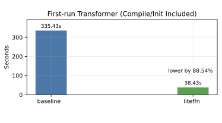
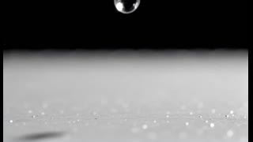
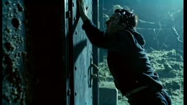

# LiteLinear

**LiteLinear** is a drop-in `nn.Linear` replacement that decomposes the weight
matrix into a low-rank pair plus an FP8 residual and runs the three GEMMs
through one fused CUDA / ROCm kernel:

$$
W \approx A \cdot B + Q_{\text{fp8}}, \qquad y = (x B^T) A^T + \text{scale} \cdot (x Q_{\text{fp8}}^T) + \text{bias}
$$

Primary use case is the large linear layers in transformer blocks (LTX-Video,
LTX-2, Wan, Hunyuan-Video, HF LLMs).

The 0.3.0 release is the post-refactor surface: a single `LiteLinear` module
with an honest `nn.Module` `state_dict` (no lazy materialization, no cache
files), an offline `lite-linear convert` CLI to rewrite `.safetensors`
checkpoints, and a forward-hook `Calibrator` for data-aware decomposition
(R = XᵀX/N).

## LTX2 LiteLinear vs Baseline (FA3 Self-Attn, No-Calib)

### Timing Overview

<div align="center">
<table><tr>
<td align="center"></td>
<td align="center"></td>
</tr></table>

| Group | Transformer Mean, s | Min, s | Max, s | Std, s | Transformer % Faster | Decode Mean, s | Save, s | E2E Total, s | E2E % Faster |
| --- | ---: | ---: | ---: | ---: | ---: | ---: | ---: | ---: | ---: |
| baseline | 4.520 | 4.460 | 4.650 | 0.070 | 0.00% | 3.710 | 5.100 | 13.330 | 0.00% |
| litelinear | 3.500 | 3.490 | 3.520 | 0.010 | 22.57% | 3.710 | 5.100 | 12.310 | 7.65% |

</div>

### First-Run Compile Effect

<div align="center" style="max-width: 420px; margin-left: auto; margin-right: auto">



| Group | First-run transformer, s | % Lower vs Baseline |
| --- | ---: | ---: |
| baseline | 335.430 | 0.00% |
| litelinear (mean r32/r64/r512) | 38.433 | 88.54% |

</div>

### Memory comparison

It focuses on `warmup+bench` memory behavior, where LiteLinear shows lower allocated VRAM:

- Peak allocated: `65,633.66 MB` (baseline) vs `58,058.06 MB` (LiteLinear)
- Average allocated: `58,858.35 MB` (baseline) vs `43,476.85 MB` (LiteLinear)


## Required Metrics

- **MSE**: Mean Squared Error between baseline and test frames (lower is better).
- **PSNR**: Peak Signal-to-Noise Ratio (dB) from MSE (higher is better). Pass: **> 20.0 dB**.
- **CLIP image similarity**: Cosine similarity, baseline vs test frames (higher is better).
- **CLIP text similarity**: Cosine similarity, prompt vs test frames (higher is better).
- **FVD** (i3d): Fréchet Video Distance, baseline vs test sets (lower is better). Per prompt; degradation threshold: **< 10.0%**.


### LTX2 metrics (q_sample, i3d)


#### PSNR, Per Prompt, Group Means, dB

<div align="center">

| Prompt | baseline1 vs baseline2..10 | baseline1 vs r32 group | baseline1 vs r64 group | baseline1 vs r512 group |
| --- | ---: | ---: | ---: | ---: |
| a-dramatic-underwater-scene-featuring-a-person-s | 41.747 | 19.823 | 19.822 | 20.413 |
| a-man-in-a-sleek-modern-jetpack-flying-upwards-t | 43.306 | 20.872 | 21.517 | 21.163 |
| a-serene-view-of-the-banks-of-the-rhine-river-sh | 38.664 | 20.277 | 20.208 | 19.735 |
| a-single-water-droplet-falls-from-a-height-movin | 28.724 | 27.827 | 27.375 | 30.680 |
| two-anthropomorphic-cats-boxing-in-a-well-lit-ar | ~identical (MSE=0) | 18.646 | 20.924 | 21.188 |

</div>

**Prompt PSNR summary**

| Prompt | PSNR Pass | Pass/Total |
| --- | --- | --- |
| a-dramatic-underwater-scene-featuring-a-person-s | ✅ | 10/30 |
| a-man-in-a-sleek-modern-jetpack-flying-upwards-t | ✅ | 30/30 |
| a-serene-view-of-the-banks-of-the-rhine-river-sh | ✅ | 20/30 |
| a-single-water-droplet-falls-from-a-height-movin | ✅ | 30/30 |
| two-anthropomorphic-cats-boxing-in-a-well-lit-ar | ✅ | 20/30 |

#### CLIP Similarity (Per Prompt, Rank Group Means)

| Prompt | CLIP Image r32 | CLIP Text r32 | CLIP Image r64 | CLIP Text r64 | CLIP Image r512 | CLIP Text r512 |
| --- | ---: | ---: | ---: | ---: | ---: | ---: |
| a-dramatic-underwater-scene-featuring-a-person-s | 0.9601 | 0.3058 | 0.9593 | 0.3037 | 0.9590 | 0.3116 |
| a-man-in-a-sleek-modern-jetpack-flying-upwards-t | 0.9636 | 0.3365 | 0.9634 | 0.3222 | 0.9620 | 0.3199 |
| a-serene-view-of-the-banks-of-the-rhine-river-sh | 0.9736 | 0.2656 | 0.9726 | 0.2739 | 0.9633 | 0.2703 |
| a-single-water-droplet-falls-from-a-height-movin | 0.9629 | 0.3594 | 0.9635 | 0.3544 | 0.9780 | 0.3683 |
| two-anthropomorphic-cats-boxing-in-a-well-lit-ar | 0.9739 | 0.3634 | 0.9738 | 0.3669 | 0.9798 | 0.3662 |


**FVD (per prompt + rank)**

| Prompt | Rank | FVD | Degradation | Pass | Videos | Baselines |
| --- | --- | ---: | ---: | --- | ---: | ---: |
| a-dramatic-underwater-scene-featuring-a-person-s | r32 | 8.8313 | 2922.27% | ❌ | 10 | 10 |
| a-dramatic-underwater-scene-featuring-a-person-s | r512 | 8.1199 | 2678.84% | ❌ | 10 | 10 |
| a-dramatic-underwater-scene-featuring-a-person-s | r64 | 18.2055 | 6130.36% | ❌ | 10 | 10 |
| a-man-in-a-sleek-modern-jetpack-flying-upwards-t | r32 | 16.8284 | 9496.61% | ❌ | 10 | 10 |
| a-man-in-a-sleek-modern-jetpack-flying-upwards-t | r512 | 21.2910 | 12041.49% | ❌ | 10 | 10 |
| a-man-in-a-sleek-modern-jetpack-flying-upwards-t | r64 | 21.7506 | 12303.55% | ❌ | 10 | 10 |
| a-serene-view-of-the-banks-of-the-rhine-river-sh | r32 | 1.2744 | 1459.17% | ❌ | 10 | 10 |
| a-serene-view-of-the-banks-of-the-rhine-river-sh | r512 | 2.5507 | 3020.73% | ❌ | 10 | 10 |
| a-serene-view-of-the-banks-of-the-rhine-river-sh | r64 | 1.9026 | 2227.73% | ❌ | 10 | 10 |
| a-single-water-droplet-falls-from-a-height-movin | r32 | 20.4085 | 588.22% | ❌ | 10 | 10 |
| a-single-water-droplet-falls-from-a-height-movin | r512 | 24.1211 | 713.41% | ❌ | 10 | 10 |
| a-single-water-droplet-falls-from-a-height-movin | r64 | 30.4487 | 926.79% | ❌ | 10 | 10 |
| two-anthropomorphic-cats-boxing-in-a-well-lit-ar | r32 | 9.7384 | N/A | N/A | 10 | 10 |
| two-anthropomorphic-cats-boxing-in-a-well-lit-ar | r512 | 18.6098 | N/A | N/A | 10 | 10 |
| two-anthropomorphic-cats-boxing-in-a-well-lit-ar | r64 | 15.0996 | N/A | N/A | 10 | 10 |

#### Video samples (baseline vs LiteLinear r32 / r64 / r512)

Click a thumbnail to play the video.

| Baseline | LiteLinear r32 | LiteLinear r64 | LiteLinear r512 |
| --- | --- | --- | --- |
| [](docs/assets/ltx-2-19b-distilled_p001_h6482cab9_s486307_f72_baseline_i01_a-single-water-droplet-falls-from-a-height-movin.mp4) | [](docs/assets/ltx-2-19b-distilled_p001_h6482cab9_s486307_f72_liteffn_r32_nocalib_i01_a-single-water-droplet-falls-from-a-height-movin.mp4) | [](docs/assets/ltx-2-19b-distilled_p001_h6482cab9_s486307_f72_liteffn_r64_nocalib_i01_a-single-water-droplet-falls-from-a-height-movin.mp4) | [](docs/assets/ltx-2-19b-distilled_p001_h6482cab9_s486307_f72_liteffn_r512_nocalib_i01_a-single-water-droplet-falls-from-a-height-movin.mp4) |
| [](docs/assets/ltx-2-19b-distilled_p002_h757f9ac3_s789012_f72_baseline_i01_a-man-in-a-sleek-modern-jetpack-flying-upwards-t.mp4) | [](docs/assets/ltx-2-19b-distilled_p002_h757f9ac3_s789012_f72_liteffn_r32_nocalib_i01_a-man-in-a-sleek-modern-jetpack-flying-upwards-t.mp4) | [](docs/assets/ltx-2-19b-distilled_p002_h757f9ac3_s789012_f72_liteffn_r64_nocalib_i01_a-man-in-a-sleek-modern-jetpack-flying-upwards-t.mp4) | [](docs/assets/ltx-2-19b-distilled_p002_h757f9ac3_s789012_f72_liteffn_r512_nocalib_i01_a-man-in-a-sleek-modern-jetpack-flying-upwards-t.mp4) |
| [](docs/assets/ltx-2-19b-distilled_p003_h0c667058_s650048_f72_baseline_i01_two-anthropomorphic-cats-boxing-in-a-well-lit-ar.mp4) | [](docs/assets/ltx-2-19b-distilled_p003_h0c667058_s650048_f72_liteffn_r32_nocalib_i01_two-anthropomorphic-cats-boxing-in-a-well-lit-ar.mp4) | [](docs/assets/ltx-2-19b-distilled_p003_h0c667058_s650048_f72_liteffn_r64_nocalib_i01_two-anthropomorphic-cats-boxing-in-a-well-lit-ar.mp4) | [](docs/assets/ltx-2-19b-distilled_p003_h0c667058_s650048_f72_liteffn_r512_nocalib_i01_two-anthropomorphic-cats-boxing-in-a-well-lit-ar.mp4) |
| [](docs/assets/ltx-2-19b-distilled_p004_h97e8e2d0_s960015_f72_baseline_i01_a-serene-view-of-the-banks-of-the-rhine-river-sh.mp4) | [](docs/assets/ltx-2-19b-distilled_p004_h97e8e2d0_s960015_f72_liteffn_r32_nocalib_i01_a-serene-view-of-the-banks-of-the-rhine-river-sh.mp4) | [](docs/assets/ltx-2-19b-distilled_p004_h97e8e2d0_s960015_f72_liteffn_r64_nocalib_i01_a-serene-view-of-the-banks-of-the-rhine-river-sh.mp4) | [](docs/assets/ltx-2-19b-distilled_p004_h97e8e2d0_s960015_f72_liteffn_r512_nocalib_i01_a-serene-view-of-the-banks-of-the-rhine-river-sh.mp4) |
| [](docs/assets/ltx-2-19b-distilled_p005_h4e2b1dcb_s536857_f72_baseline_i01_a-dramatic-underwater-scene-featuring-a-person-s.mp4) | [](docs/assets/ltx-2-19b-distilled_p005_h4e2b1dcb_s536857_f72_liteffn_r32_nocalib_i01_a-dramatic-underwater-scene-featuring-a-person-s.mp4) | [](docs/assets/ltx-2-19b-distilled_p005_h4e2b1dcb_s536857_f72_liteffn_r64_nocalib_i01_a-dramatic-underwater-scene-featuring-a-person-s.mp4) | [](docs/assets/ltx-2-19b-distilled_p005_h4e2b1dcb_s536857_f72_liteffn_r512_nocalib_i01_a-dramatic-underwater-scene-featuring-a-person-s.mp4) |

Full LTX2 summary (incl. video samples, detailed tables): [metrics_summary.md](docs/ltx2_metrics_2026-02-20_recalc_i3d/metrics_summary.md) · [metrics_detailed.md](docs/ltx2_metrics_2026-02-20_recalc_i3d/metrics_detailed.md)

### LTX-Video 0.9.8 LiteLinear vs Baseline (LiteAttention self, Calibrated)

#### Timing (Video only, compile mode - default, fullgraphs - false)

| Mode | Timesteps (s) | Run inference (s) | Enhance (s) | % faster (timesteps) | % faster (total) |
| --- | ---: | ---: | ---: | ---: | ---: |
| LiteLinear | 6.80 | 8.61 | 0.72 | **7.86%** | **7.52%** |
| Baseline | 7.38 | 9.31 | 0.72 | — | — |

*Timesteps* = time inside the diffusion denoising loop (per-step transformer forward + scheduler, etc.). So it includes **non-FFN** work: attention, layernorms, embeddings, and scheduler/noise handling — only part of the step is FFN; the reported % faster is for the whole step.

- **Baselines (2)**: `baseline1`, `baseline2`
- **calibrated sample**: `lr1calib` - 25000 random prompts from [vidprom_filtered_extended.txt](https://huggingface.co/gdhe17/Self-Forcing/blob/5c6e33328c3f025cbc9c60ab31f377ef6a65cda1/vidprom_filtered_extended.txt)

#### Per-video metrics

| Video | Baseline | Rank | MSE | PSNR (dB) | PSNR Pass | CLIP Img | CLIP Text |
| --- | --- | ---: | ---: | ---: | --- | ---: | ---: |
| `lr1calib` | `baseline1` | 64 | 428.790 | 21.808 | ✅ | 0.9930 | N/A |
| `lr2` | `baseline1` | 64 | 664.877 | 19.903 | ❌ | 0.9845 | N/A |
| `lr3` | `baseline1` | 64 | 516.288 | 21.002 | ✅ | 0.9861 | N/A |

#### Prompt PSNR summary

| Prompt | PSNR Pass | Pass/Total |
| --- | --- | --- |
| Acharminganimatedsceneofafluff | ✅ | 2/3 |

#### FVD (per prompt + rank)

| Prompt | Rank | FVD | Degradation | Pass | Videos | Baselines |
| --- | --- | ---: | ---: | --- | ---: | ---: |
| Acharminganimatedsceneofafluff | r64 | 50.9825 | 554.10% | ❌ | 3 | 2 |

#### Video samples

Click a thumbnail to play the video.

<table>
<tr>
<th align="center" width="20%">baseline1</th>
<th align="center" width="20%">baseline2</th>
<th align="center" width="20%">lr1calib</th>
<th align="center" width="20%">lr2</th>
<th align="center" width="20%">lr3</th>
</tr>
<tr>
<td align="center" width="20%"><a href="docs/ltx0.9.8_metrics/validate_s171198_f121_default_bf16_baseline_Acharminganimatedsceneofafluff.mp4"></a></td>
<td align="center" width="20%"><a href="docs/ltx0.9.8_metrics/validate_s171198_f121_default_bf16_baseline_Acharminganimatedsceneofafluff_2.mp4"></a></td>
<td align="center" width="20%"><a href="docs/ltx0.9.8_metrics/validate_r64_s171198_f121_default_cxfp8_lr-cu_Acharminganimatedsceneofafluff.calib.mp4"></a></td>
<td align="center" width="20%"><a href="docs/ltx0.9.8_metrics/validate_r64_s171198_f121_default_cxfp8_lr-cu_Acharminganimatedsceneofafluff.mp4"></a></td>
<td align="center" width="20%"><a href="docs/ltx0.9.8_metrics/validate_r64_s171198_f121_default_cxfp8_lr-cu_noR_Acharminganimatedsceneofafluff.mp4"></a></td>
</tr>
</table>

Full LTX 0.9.8 summary: [metrics_summary.md](docs/ltx0.9.8_metrics/metrics_summary.md).

## Installation

Pre-built wheels live in `install/`. For the latest surface (LiteLinear,
`lite-linear convert`, R-matrix `Calibrator`, `LiteLinear.from_dense`)
use a 0.3.x wheel; the previous 0.2.x / 0.1.x wheels are kept for
backwards compatibility and the legacy `LowRankDeltaLinear` API.

| Wheel | Python | Platform | Built against | SHA-256 |
| --- | --- | --- | --- | --- |
| `install/lite_linear-0.3.0+cu128-cp310-cp310-linux_x86_64.whl` | 3.10 | NVIDIA (CUDA 12.8 runtime) | torch 2.11 cu128 | `17cda3252588849bd1a7dc6026ecb4a35a75f3970702397bcc662d7576109b9a` |
| `install/lite_linear-0.3.0+cu128-cp312-cp312-linux_x86_64.whl` | 3.12 | NVIDIA (CUDA 12.8 runtime) | torch 2.11 cu128 | `b8ed3ec4abe2f73851ed6bbec145e683497bef9711d773db558404cfda12071e` |
| `install/lite_linear-0.3.0+rocm7-cp310-cp310-linux_x86_64.whl` | 3.10 | AMD ROCm (7 runtime) | torch 2.10 rocm7.0 | `d60b7a05d8b0d1df34607d2c3913b10812842a322a3465dc3993f856aae8a317` |
| `install/lite_linear-0.3.0+rocm7-cp312-cp312-linux_x86_64.whl` | 3.12 | AMD ROCm (7 runtime) | torch 2.10 rocm7.0 | `aa696a55d39cf2881bdbe200c04c08d33a3abe11a15b4584f2015ec4bafbf28d` |
| `install/lite_linear-0.2.0+cu128-cp310-cp310-linux_x86_64.whl` | 3.10 | NVIDIA (CUDA 12.8 runtime) | torch 2.x cu128 (legacy `LowRankDeltaLinear`) | `348dae597a465fc9240e1e06956f16ef0fc7947239d65b8bb8de7d127b33391e` |
| `install/lite_linear-0.2.0+cu128-cp312-cp312-linux_x86_64.whl` | 3.12 | NVIDIA (CUDA 12.8 runtime) | torch 2.x cu128 (legacy `LowRankDeltaLinear`) | `0af112f9584494819ee4a797c3fc0897ca79f24fd350a8aaefbc5a286a5c73c0` |
| `install/lite_linear-0.1.0+rocm7-cp310-cp310-linux_x86_64.whl` | 3.10 | AMD ROCm (7 runtime) | torch 2.x rocm7 | `b0c1b773949f5638d5a7a2c9416b20956500f520d79d3ac0c11ca9b84e80912b` |
| `install/lite_linear-0.1.0+rocm7-cp312-cp312-linux_x86_64.whl` | 3.12 | AMD ROCm (7 runtime) | torch 2.x rocm7 | `0050486af8bca1949ae27e45da10a4ae614c21aa97dd4e6e4d55343b22837d88` |

Wheel filenames follow the standard format
([PEP 491](https://peps.python.org/pep-0491/#file-name-convention)):

```
{distribution}-{version}(-{build tag})?-{python tag}-{abi tag}-{platform tag}.whl
```

LiteLinear does not use the optional build tag, so:

```
lite_linear-{version}+{flavor}-cp{py}-cp{py}-{platform}.whl
```

The local version label (`+cu128`, `+rocm7`) is informational and is
not used by pip for resolution — pip matches on the public version +
the Python / ABI / platform tags.

Install a wheel into a Python environment that already has the matching
`torch` build:

```bash
# Example: install the latest cp312 wheel into a CUDA-enabled venv.
python -m pip install --force-reinstall --no-deps install/lite_linear-0.3.0+cu128-cp312-cp312-linux_x86_64.whl
```

To verify a downloaded wheel matches the SHA-256 in the table above
(this is what was committed to `develop/vhnat/release_0.3.0`):

```bash
sha256sum install/lite_linear-0.3.0+cu128-cp312-cp312-linux_x86_64.whl
# compare to: b8ed3ec4abe2f73851ed6bbec145e683497bef9711d773db558404cfda12071e
```

The wheel ships the compiled `_cuda` extension and the obfuscated Python
package; no source, no CUDA toolkit, no `lite_linear/csrc/` is required on
the host.

### Wheel payload policy

The wheel deliberately does not contain:

- `lite_linear/csrc/*` (CUDA / C++ kernel sources)
- `lite_linear/csrc_rocm/*` (HIP fallback sources)
- the unobfuscated `lite_linear/linear.py` (the fused forward is in the
  Cython-compiled `.so`; only the pure-PyTorch `linear.py` emulation path
  remains in source form)

Run `scripts/validate_wheel_contents.py --wheel <wheel>` (from the private
build repo) to confirm a wheel satisfies the policy.

## Usage

```python
import torch
from lite_linear import LiteLinear

# 1. Construct a LiteLinear in place of nn.Linear.
layer = LiteLinear(in_features=4096, out_features=16384, bias=True, rank=64)

# 2. Load pre-decomposed factors into it (output of `lite-linear convert`).
#    The state_dict keys are the four factor names: A, B, Q_fp8, Q_scale_inv,
#    and optionally bias.
state = torch.load("path/to/converted.safetensors")  # or safetensors.torch.load_model
layer.load_state_dict(state)

# 3. Move to CUDA and run (LiteLinear is GPU-only).
layer = layer.to("cuda", dtype=torch.bfloat16)
x = torch.randn(8, 4096, device="cuda", dtype=torch.bfloat16)
y = layer(x)  # (8, 16384), bfloat16
```

### From a dense `nn.Linear` (research / ad-hoc)

```python
import torch.nn as nn
from lite_linear import LiteLinear

linear = nn.Linear(4096, 16384, bias=True).cuda().bfloat16()
lite = LiteLinear.from_dense(linear, rank=64)  # SVD-based decomposition
y = lite(torch.randn(8, 4096, device="cuda", dtype=torch.bfloat16))
```

`from_dense` runs the decomposition in PyTorch (slow at large shapes — use
the offline CLI for real model conversions).

### Offline conversion (production path)

The CLI rewrites a `.safetensors` checkpoint in place, replacing each
selected `<prefix>.weight` with the four LiteLinear factor keys:

```bash
# Single shard:
python -m lite_linear convert model.safetensors --regex 'ffn\.(0|2)' --rank 64

# HF-sharded checkpoint (Diffusers-style index):
python -m lite_linear convert-sharded \
    path/to/diffusion_pytorch_model.safetensors.index.json \
    --regex 'ffn\.(0|2)' \
    --rank 64

# Per-prefix ranks via a manifest:
python -m lite_linear convert model.safetensors --manifest ranks.toml
```

Other commands:

```bash
python -m lite_linear --help                    # list subcommands
python -m lite_linear inspect model.safetensors  # list 2D weight keys
python -m lite_linear convert --help            # per-flag docs
```

See `docs/integration_guide.md` for the full integration surface and the
Wan / LTX-style host-loader patterns.

### R-matrix calibration (optional, data-aware decomposition)

For better low-rank quality, capture an R = E[XᵀX] matrix per layer from
real prompts and pass it to `convert`:

```python
import torch
from lite_linear.calibration import Calibrator
from lite_linear import LiteLinear

class ToyModel(torch.nn.Module):
    def __init__(self):
        super().__init__()
        self.fc1 = LiteLinear(1024, 4096, rank=64, bias=True)
        self.fc2 = LiteLinear(4096, 1024, rank=64, bias=True)
    def forward(self, x):
        return self.fc2(torch.relu(self.fc1(x)))

model = ToyModel().cuda().bfloat16()
with Calibrator(model) as cal:
    for _ in range(50):
        cal.accumulate(model(torch.randn(2, 1024, device="cuda", dtype=torch.bfloat16)))
cal.save("r_matrices.safetensors")  # feed to `lite-linear convert --r-matrices`
```

## Integration guide

The end-to-end shape of an integration is:

1. **Architecture**: replace the FFN linear(s) with `LiteLinear` at model
   construction time. Wan: `ffn.0` + `ffn.2`. LTX-style: pass the activation
   projection through `LiteLinear.replace_activation_proj_()` (when the
   upstream model wraps the first linear in a GEGLU).
2. **Checkpoint**: convert the dense weights to LiteLinear factors ahead of
   time with `lite-linear convert` (or `convert-sharded`). Load the
   converted snapshot with the host framework's normal loader — no special
   hooks needed, `LiteLinear.load_state_dict` consumes the factor keys
   directly.

The smallest end-to-end example lives in `examples/wan_integration.py`.
The full surface (per-rank manifest, sharded checkpoints, R-matrix
calibration, per-shard CLI flags) is documented in
[`docs/integration_guide.md`](docs/integration_guide.md).

### LTX-2 LoRA pipeline (two-step case)

LTX-2 pipelines that pass a distilled LoRA at runtime need an extra
flag on `lite-linear convert`: `--lora` + `--lora-strength`. Without
it, the converted FF layers lose their `<prefix>.weight` tensor and
the runtime LoRA delta has nothing to apply to. With it, the converter
fuses `W + strength * lora_B @ lora_A` into the selected dense FF
weights *before* decomposition, so the runtime LoRA is baked into
`Q_fp8` for those layers (non-selected dense layers still receive the
LoRA delta normally). See
[`docs/integration_guide.md`](docs/integration_guide.md#ltx-2-lora-pipeline-two-step-case)
for the full recipe.

## Features

- **Drop-in `nn.Linear` replacement**: same constructor signature
  (`in_features`, `out_features`, `bias`), same forward signature
  (`y = layer(x)`).
- **Low-rank + FP8 decomposition**: `W ≈ A · B + Q_fp8` with `A`, `B`
  in bf16 and `Q_fp8` in `e4m3fn` (NVIDIA) / `e4m3fnuz` (AMD).
- **Fused CUDA / HIP kernel**: one GEMM call covers the bf16 low-rank pair
  plus the FP8 residual and the bias add.
- **Honest `nn.Module` state_dict**: factor keys (`A`, `B`, `Q_fp8`,
  `Q_scale_inv`, `bias`) are plain `nn.Parameter`s — load / save with
  ordinary PyTorch tooling, no cache files.
- **Offline `lite-linear convert` CLI**: rewrites safetensors checkpoints
  in place; per-prefix ranks via `--manifest` or a uniform `--rank` via
  `--regex`.
- **R-matrix calibration**: forward-hook `Calibrator` captures per-layer
  `R = XᵀX / N` for data-aware decomposition.
- **Pure-PyTorch fallback**: when neither native extension loads
  (e.g. CPU-only env), `LiteLinear` runs a slow PyTorch path that mirrors
  the fused kernel cast-for-cast.

## Tested hardware (for the LTX-2 / LTX-Video metrics above)

- GPU model: `NVIDIA H200`
- VRAM: `143771 MiB`
- Driver / CUDA: `590.48.01` / `13.1`

## Performance Benchmark on shapes captured from LTX-Video

These are kernel-microbench numbers (`lite_linear._cuda.fused_forward`)
against real LTX-Video FFN shapes (24-frame inference, M = flattened
activation rows).

Units:

- per-shape rows: `us`
- `TOTAL` row: `ms`

Column glossary:

- `Cfg`: FFN projection shape (`w1` = up-proj, `w2` = down-proj).
- `M`: flattened activation rows for that GEMM shape.
- `Count`: number of calls for that shape in the captured workload.
- `Lin`: baseline `nn.Linear` latency.
- `TE`: Transformer Engine linear latency.
- `PT`: LiteLinear PyTorch path latency.
- `Accel`: LiteLinear accelerated path latency.
- `TE%` / `PT%` / `Accel%`: relative improvement vs baseline linear
  (`+` is faster, `-` is slower).
- `TOTAL`: count-weighted aggregate across listed shapes.

```text
Cfg      M  Count |  Lin    TE    PT Accel |    TE%    PT% Accel%
------------------------------------------------------------------
w2    1400    336 |  392   260   298   186 | +33.7% +23.8% +52.5%
w1    1400    336 |  378   273   301   182 | +27.8% +20.3% +51.7%
w2    2450    336 |  597   437   501   317 | +26.8% +15.9% +46.9%
w1    2450    336 |  562   455   511   302 | +19.0%  +9.1% +46.2%
w2    5600    480 | 1213   994  1215   762 | +18.1%  -0.1% +37.2%
w1    5600    480 | 1141  1097  1198   712 |  +3.8%  -5.0% +37.6%
w2    9800    144 | 2008  1763  2074  1261 | +12.2%  -3.3% +37.2%
w1    9800    144 | 1946  1868  2042  1202 |  +4.0%  -4.9% +38.3%
w2   10850    336 | 2277  2110  2281  1395 |  +7.4%  -0.2% +38.8%
w1   10850    336 | 2035  2156  2215  1324 |  -5.9%  -8.9% +34.9%
w2   22400    144 | 4889  4506  4596  3018 |  +7.8%  +6.0% +38.3%
w1   22400    144 | 4714  4581  4471  2805 |  +2.8%  +5.1% +40.5%
w2   43400    144 | 9275  8285  8845  5772 | +10.7%  +4.6% +37.8%
w1   43400    144 | 8847  8460  8669  5328 |  +4.4%  +2.0% +39.8%
------------------------------------------------------------------
TOTAL        3840 | 7788  7158  7631  4744 |  +8.1%  +2.0% +39.1%
```

## Examples

| File | What it shows |
| --- | --- |
| `examples/wan_integration.py` | End-to-end Wan-style integration: construct a tiny model with `LiteLinear` FFNs, run a forward on CUDA, and (with `--checkpoint`) load a converted snapshot. |
| `examples/bench_ffn.py` | Kernel microbench: `nn.Linear` vs PyTorch FP8 path vs `lite_linear._cuda.fused_forward` on the captured LTX-Video FFN shape set. |
| `examples/bench_lrdelta.py` | Module-level bench: `nn.Linear` vs `LiteLinear` (end-to-end Python path) vs the raw `fused_forward` kernel. Optional `--include-te` for TE comparison. |
| `examples/bench_lrdelta_amd.py` | Same as `bench_lrdelta.py` but for the ROCm `lite_linear._rocm` path. |

## Additional docs

- `docs/integration_guide.md`: end-to-end Wan / LTX integration patterns.
- `docs/kernel.md`: wheel payload policy, runtime compatibility notes,
  validation, benchmarking.
