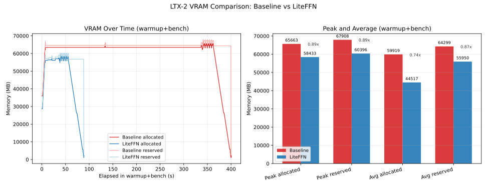

# LiteFFN

**LiteFFN** is a specialized PyTorch module designed to replace standard `nn.Linear` layers in Feed-Forward Networks (FFN), specifically targeting LTX-Video contexts. It implements a decomposition strategy:

$$
W \approx A \cdot B + Q, \quad Q \to \text{FP8}
$$

Where the computation is performed using a custom fused CUDA kernel:

$$
y = (x B^T) A^T + \text{scale} \cdot (x Q_{\text{fp8}}^T) + \text{bias}
$$

This approach allows for significant memory savings and potential speedups by utilizing low-rank approximations and FP8 arithmetic for the residual.


## LTX2 LiteFFN vs Baseline (FA3 Self-Attn, No-Calib)

### Timing Overview

<div align="center">
<table><tr>
<td align="center"></td>
</tr></table>
</div>

| Group | Transformer<br>Mean, s | Min, s | Max, s | Std, s | Transformer % Faster | 
| :--- | :---: | :---: | :---: | :---: | :---: |
| baseline | 4.520 | 4.460 | 4.650 | 0.070 | 0.00% | 
| **liteffn** | **3.500** | **3.490** | **3.520** | **0.010** | **22.57** | 

| Group | Decode Mean, s | Save, s | E2E Total, s | E2E % Faster |
| :--- | :---: | :---: | :---: | :---: |
| baseline | 3.710 | 5.100 | 13.330 | 0.00% |
| **liteffn** | 3.710 | 5.100 | 12.310 | 7.65% |


### First-Run Compile Effect

<div align="center" style="max-width: 420px; margin-left: auto; margin-right: auto">


| Group | First-run transformer, s | % Lower vs Baseline |
| --- | ---: | ---: |
| baseline | 335.430 | 0.00% |
| **liteffn** (mean r32/r64/r512) | **38.433** | **88.54%** |

</div>

### Allocated VRAM Reduction

It focuses on `warmup+bench` memory behavior, where LiteFFN shows lower allocated VRAM:

- Peak allocated: `65,663.00 MB` (baseline) vs `58,433.00 MB` (LiteFFN)
- Average allocated: `59,919.00 MB` (baseline) vs `44,517.00 MB` (LiteFFN)

| Configuration | Average | Peak | Peak relative to Baseline |
| --- | --- | --- | --- |
| Original (FP16) | 59,919.00 MB | 65,663.00 MB | 100% |
| rank=64, LR FP16 decomp | **44,517.00 MB** | **58,433.00 MB** | 89.0% |



## Required Metrics

- **MSE**: Mean Squared Error between baseline and test frames (lower is better).
- **PSNR**: Peak Signal-to-Noise Ratio (dB) from MSE (higher is better).
- **CLIP image similarity**: Cosine similarity, baseline vs test frames (higher is better).
- **CLIP text similarity**: Cosine similarity, prompt vs test frames (higher is better).


### LTX2 metrics (q_sample, i3d)


#### PSNR, Per Prompt, Group Means, dB

<div align="center">

| Prompt | baseline1 vs baseline2..10 | baseline1 vs r32 group | baseline1 vs r64 group | baseline1 vs r512 group |
| --- | ---: | ---: | ---: | ---: |
| a-dramatic-underwater-scene-featuring-a-person-s | 41.747 | 19.823 | 19.822 | 20.413 |
| a-man-in-a-sleek-modern-jetpack-flying-upwards-t | 43.306 | 20.872 | 21.517 | 21.163 |
| a-serene-view-of-the-banks-of-the-rhine-river-sh | 38.664 | 20.277 | 20.208 | 19.735 |
| a-single-water-droplet-falls-from-a-height-movin | 28.724 | 27.827 | 27.375 | 30.680 |
| two-anthropomorphic-cats-boxing-in-a-well-lit-ar | ~identical (MSE=0) | 18.646 | 20.924 | 21.188 |

</div>

**Prompt PSNR summary**

| Prompt | PSNR Pass | Pass/Total |
| --- | --- | --- |
| a-dramatic-underwater-scene-featuring-a-person-s | ✅ | 10/30 |
| a-man-in-a-sleek-modern-jetpack-flying-upwards-t | ✅ | 30/30 |
| a-serene-view-of-the-banks-of-the-rhine-river-sh | ✅ | 20/30 |
| a-single-water-droplet-falls-from-a-height-movin | ✅ | 30/30 |
| two-anthropomorphic-cats-boxing-in-a-well-lit-ar | ✅ | 20/30 |

#### CLIP Similarity (Per Prompt, Rank Group Means)

| Prompt | CLIP Image r32 | CLIP Text r32 | CLIP Image r64 | CLIP Text r64 | CLIP Image r512 | CLIP Text r512 |
| --- | ---: | ---: | ---: | ---: | ---: | ---: |
| a-dramatic-underwater-scene-featuring-a-person-s | 0.9601 | 0.3058 | 0.9593 | 0.3037 | 0.9590 | 0.3116 |
| a-man-in-a-sleek-modern-jetpack-flying-upwards-t | 0.9636 | 0.3365 | 0.9634 | 0.3222 | 0.9620 | 0.3199 |
| a-serene-view-of-the-banks-of-the-rhine-river-sh | 0.9736 | 0.2656 | 0.9726 | 0.2739 | 0.9633 | 0.2703 |
| a-single-water-droplet-falls-from-a-height-movin | 0.9629 | 0.3597 | 0.9635 | 0.3544 | 0.9780 | 0.3683 |
| two-anthropomorphic-cats-boxing-in-a-well-lit-ar | 0.9739 | 0.3634 | 0.9738 | 0.3669 | 0.9798 | 0.3662 |


#### Video samples (baseline vs LiteFFN r32 / r64 / r512)

Click a thumbnail to play the video.

| Baseline | LiteFFN r32 | LiteFFN r64 | LiteFFN r512 |
| --- | --- | --- | --- |
| [](docs/assets/ltx-2-19b-distilled_p001_h6482cab9_s486307_f72_baseline_i01_a-single-water-droplet-falls-from-a-height-movin.mp4) | [](docs/assets/ltx-2-19b-distilled_p001_h6482cab9_s486307_f72_liteffn_r32_nocalib_i01_a-single-water-droplet-falls-from-a-height-movin.mp4) | [](docs/assets/ltx-2-19b-distilled_p001_h6482cab9_s486307_f72_liteffn_r64_nocalib_i01_a-single-water-droplet-falls-from-a-height-movin.mp4) | [](docs/assets/ltx-2-19b-distilled_p001_h6482cab9_s486307_f72_liteffn_r512_nocalib_i01_a-single-water-droplet-falls-from-a-height-movin.mp4) |
| [](docs/assets/ltx-2-19b-distilled_p002_h757f9ac3_s789012_f72_baseline_i01_a-man-in-a-sleek-modern-jetpack-flying-upwards-t.mp4) | [](docs/assets/ltx-2-19b-distilled_p002_h757f9ac3_s789012_f72_liteffn_r32_nocalib_i01_a-man-in-a-sleek-modern-jetpack-flying-upwards-t.mp4) | [](docs/assets/ltx-2-19b-distilled_p002_h757f9ac3_s789012_f72_liteffn_r64_nocalib_i01_a-man-in-a-sleek-modern-jetpack-flying-upwards-t.mp4) | [](docs/assets/ltx-2-19b-distilled_p002_h757f9ac3_s789012_f72_liteffn_r512_nocalib_i01_a-man-in-a-sleek-modern-jetpack-flying-upwards-t.mp4) |
| [](docs/assets/ltx-2-19b-distilled_p003_h0c667058_s650048_f72_baseline_i01_two-anthropomorphic-cats-boxing-in-a-well-lit-ar.mp4) | [](docs/assets/ltx-2-19b-distilled_p003_h0c667058_s650048_f72_liteffn_r32_nocalib_i01_two-anthropomorphic-cats-boxing-in-a-well-lit-ar.mp4) | [](docs/assets/ltx-2-19b-distilled_p003_h0c667058_s650048_f72_liteffn_r64_nocalib_i01_two-anthropomorphic-cats-boxing-in-a-well-lit-ar.mp4) | [](docs/assets/ltx-2-19b-distilled_p003_h0c667058_s650048_f72_liteffn_r512_nocalib_i01_two-anthropomorphic-cats-boxing-in-a-well-lit-ar.mp4) |
| [](docs/assets/ltx-2-19b-distilled_p004_h97e8e2d0_s960015_f72_baseline_i01_a-serene-view-of-the-banks-of-the-rhine-river-sh.mp4) | [](docs/assets/ltx-2-19b-distilled_p004_h97e8e2d0_s960015_f72_liteffn_r32_nocalib_i01_a-serene-view-of-the-banks-of-the-rhine-river-sh.mp4) | [](docs/assets/ltx-2-19b-distilled_p004_h97e8e2d0_s960015_f72_liteffn_r64_nocalib_i01_a-serene-view-of-the-banks-of-the-rhine-river-sh.mp4) | [](docs/assets/ltx-2-19b-distilled_p004_h97e8e2d0_s960015_f72_liteffn_r512_nocalib_i01_a-serene-view-of-the-banks-of-the-rhine-river-sh.mp4) |
| [](docs/assets/ltx-2-19b-distilled_p005_h4e2b1dcb_s536857_f72_baseline_i01_a-dramatic-underwater-scene-featuring-a-person-s.mp4) | [](docs/assets/ltx-2-19b-distilled_p005_h4e2b1dcb_s536857_f72_liteffn_r32_nocalib_i01_a-dramatic-underwater-scene-featuring-a-person-s.mp4) | [](docs/assets/ltx-2-19b-distilled_p005_h4e2b1dcb_s536857_f72_liteffn_r64_nocalib_i01_a-dramatic-underwater-scene-featuring-a-person-s.mp4) | [](docs/assets/ltx-2-19b-distilled_p005_h4e2b1dcb_s536857_f72_liteffn_r512_nocalib_i01_a-dramatic-underwater-scene-featuring-a-person-s.mp4) |


### LTX-Video 0.9.8 LiteFFN vs Baseline (LiteAttention self, Calibrated)

#### Timing (Video only, compile mode - default, fullgraphs - false)

| Mode | Timesteps (s) | Run inference (s) | Enhance (s) | % faster (timesteps) | % faster (total) |
| --- | --- | --- | --- | --- | --- |
| LiteFFN | 6.80 | 8.61 | 0.72 | **7.86%** | **7.52%** |
| Baseline | 7.38 | 9.31 | 0.72 | — | — |

*Timesteps* = time inside the diffusion denoising loop (per-step transformer forward + scheduler, etc.). So it includes **non-FFN** work: attention, layernorms, embeddings, and scheduler/noise handling — only part of the step is FFN; the reported % faster is for the whole step.

- **Baselines (2)**: `baseline1`, `baseline2`
- **calibrated sample**: `lr1calib` - 25000 random prompts from [vidprom_filtered_extended.txt](https://huggingface.co/gdhe17/Self-Forcing/blob/5c6e33328c3f025cbc9c60ab31f377ef6a65cda1/vidprom_filtered_extended.txt)

#### Per-video metrics

| Video | Baseline | Rank | MSE | PSNR (dB) | PSNR Pass | CLIP Img | CLIP Text |
| --- | --- | --- | --- | --- | --- | --- | --- |
| `lr1calib` | `baseline1` | 64 | 428.790 | 21.808 | ✅ | 0.9930 | N/A |
| `lr2` | `baseline1` | 64 | 664.877 | 19.903 | 🟨 | 0.9845 | N/A |
| `lr3` | `baseline1` | 64 | 516.288 | 21.002 | ✅ | 0.9861 | N/A |

#### Prompt PSNR summary

| Prompt | PSNR Pass | Pass/Total |
| --- | --- | --- |
| Acharminganimatedsceneofafluff | ✅ | 2/3 |


#### Video samples

Click a thumbnail to play the video.

<table>
<tr>
<th align="center" width="20%">baseline1</th>
<th align="center" width="20%">baseline2</th>
<th align="center" width="20%">lr1calib</th>
<th align="center" width="20%">lr2</th>
<th align="center" width="20%">lr3</th>
</tr>
<tr>
<td align="center" width="20%"><a href="docs/ltx0.9.8_metrics/validate_s171198_f121_default_bf16_baseline_Acharminganimatedsceneofafluff.mp4"></a></td>
<td align="center" width="20%"><a href="docs/ltx0.9.8_metrics/validate_s171198_f121_default_bf16_baseline_Acharminganimatedsceneofafluff_2.mp4"></a></td>
<td align="center" width="20%"><a href="docs/ltx0.9.8_metrics/validate_r64_s171198_f121_default_cxfp8_lr-cu_Acharminganimatedsceneofafluff.calib.mp4"></a></td>
<td align="center" width="20%"><a href="docs/ltx0.9.8_metrics/validate_r64_s171198_f121_default_cxfp8_lr-cu_Acharminganimatedsceneofafluff.mp4"></a></td>
<td align="center" width="20%"><a href="docs/ltx0.9.8_metrics/validate_r64_s171198_f121_default_cxfp8_lr-cu_noR_Acharminganimatedsceneofafluff.mp4"></a></td>
</tr>
</table>

## Installation

Ensure you have a CUDA-compatible environment (CUDA 12.x recommended) and PyTorch installed.

Install the Python package:

Python 3.10
```bash
python -m pip install ./install/liteffn-0.1.0-cp310-cp310-linux_x86_64.whl
```
Python 3.12
```bash
python -m pip install ./install/liteffn-0.1.0-cp312-cp312-linux_x86_64.whl
```

## Usage

```python
import torch
from LiteFFN import LiteLinear

# Standalone usage (manual materialization)
# - Requires the `LiteFFN._cuda` extension (see Installation)
# - Requires CUDA weights/inputs
# - Note: `materialize_from_weight()` is silent; 
# logs only appear for auto-materialization (triggered by `.eval()` or first forward). 
linear = LiteLinear(in_features=1024, out_features=4096, rank=64, device="cuda", dtype=torch.bfloat16)

# Load/set weights BEFORE materialization
with torch.no_grad():
    linear.weight.copy_(torch.randn(4096, 1024, dtype=torch.bfloat16, device="cuda"))
    if linear.bias is not None:
        linear.bias.zero_()

# Decompose once (installs FP8+LR factors), then run
linear.materialize_from_weight()

# Forward pass (uses fused kernel if available)
x = torch.randn(16, 1024, dtype=torch.bfloat16, device="cuda")
y = linear(x)
```

## Features

- **Low-Rank Decomposition**: Decomposes weights into low-rank factors $A$ and $B$.
- **FP8 Quantization**: Quantizes the residual $Q$ to FP8 (E4M3FN) for efficiency.
- **Fused CUDA Kernel**: Optimized custom CUDA kernel for the fused operation.
- **Drop-in Replacement**: Can often replace `nn.Linear` in existing Transformers with minimal code changes.

## Tested hardware (for metrics below)

- GPU model: `NVIDIA H200`
- VRAM: `143771 MiB`
- Driver / CUDA: `590.48.01` / `13.1`
- Note: benchmark and noise snapshots in this README were collected on this device.

## Performance Benchmark on shapes captured from LTX-Video

Units:

- per-shape rows: `us`
- `TOTAL` row: `ms`

Column glossary:

- `Cfg`: FFN projection shape (`w1` = up-proj, `w2` = down-proj).
- `M`: flattened activation rows for that GEMM shape.
- `Count`: number of calls for that shape in the captured workload.
- `Lin`: baseline `nn.Linear` latency.
- `TE`: Transformer Engine linear latency.
- `CUDA`: LiteFFN CUDA path latency.
- speedup multiplier vs baseline torch.nn.linear (`>1` is faster, `<1` is slower).
- `TOTAL`: count-weighted aggregate across listed shapes.

```text
Cfg      M  Count |  Lin    TE  CUDA |   TE_x CUDA_x
------------------------------------------------------
w2    1400    336 |  392   260   186 |  1.508x 2.108x
w1    1400    336 |  378   273   182 |  1.385x 2.077x
w2    2450    336 |  597   437   317 |  1.366x 1.883x
w1    2450    336 |  562   455   302 |  1.235x 1.861x
w2    5600    480 | 1213   994   762 |  1.220x 1.592x
w1    5600    480 | 1141  1097   712 |  1.040x 1.603x
w2    9800    144 | 2008  1763  1261 |  1.139x 1.592x
w1    9800    144 | 1946  1868  1202 |  1.042x 1.619x
w2   10850    336 | 2277  2110  1395 |  1.079x 1.632x
w1   10850    336 | 2035  2156  1324 |  0.944x 1.537x
w2   22400    144 | 4889  4506  3018 |  1.085x 1.620x
w1   22400    144 | 4714  4581  2805 |  1.029x 1.681x
w2   43400    144 | 9275  8285  5772 |  1.119x 1.607x
w1   43400    144 | 8847  8460  5328 |  1.046x 1.660x
------------------------------------------------------
TOTAL        3840 | 7788  7158  4744 |  1.088x 1.642x
```

## Integration example: from [LTX-Video integration](https://github.com/moonmath-ai/LTX-Video/pull/14)

This repo integrates `LiteLinear` into LTX-Video transformer FFNs (w1 + w2), behind an env var:

```bash
# Enable (default)
export USE_LITE_LINEAR=1

# Disable (use standard nn.Linear)
export USE_LITE_LINEAR=0
```

Implementation lives in `../ltx_video/models/transformers/attention.py` (see also `../LiteFFN_integration.md`).

Example (from `FeedForward.__init__` in
[`attention.py#L1294-L1318`](https://github.com/moonmath-ai/LTX-Video/blob/267d4d5b34aa0b6b0859d60e8767b95da824c8b5/ltx_video/models/transformers/attention.py#L1294-L1318):

```python
linear_cls = nn.Linear

# act_fn = GELU/GEGLU/ApproximateGELU(...)

if USE_LITE_LINEAR:
    # FFN w1: diffusers activations create an internal `nn.Linear` at `act_fn.proj`.
    # Replace it with LiteLinear (centralized helper; keeps state_dict keys stable).
    (linear_cls := LiteLinear).replace_activation_proj_(act_fn)

# FFN w2: it will use LiteLinear for the output projection too.
self.net.append(linear_cls(inner_dim, dim_out, bias=bias))
```

Runtime behavior:

- `model.eval()` triggers a one-time decomposition+cache/load pass for all `LiteLinear` instances (after weights are loaded and moved to CUDA).
- Factor files are stored under `<cache_root>/lr_data/`, where cache root resolution is:
  1. `${LITEFFN_CACHE}` (if set)
  2. `${HF_HOME}/liteffn_cache` (if `HF_HOME` is set)
  3. `<current_program_dir>/liteffn_cache` (when the main script path is known)
  4. `<current_working_dir>/liteffn_cache` (fallback when program path is unavailable)
- Examples: `${LITEFFN_CACHE}/lr_data/`, `${HF_HOME}/liteffn_cache/lr_data/`, `<current_program_dir>/liteffn_cache/lr_data/`, `<current_working_dir>/liteffn_cache/lr_data/`.
- Cache filename defaults to `lite_linear_<fingerprint>_r<rank>_<calib|nocalib>.safetensors`.
- The calib tag is derived from safetensors metadata (`with_r=1` when R is baked into B/Q). If both caches exist, calibrated is preferred.
- A warning is emitted if filename tag disagrees with metadata (`with_r`).

Troubleshooting:

- `ImportError: LiteFFN._cuda ...`: build/install the extension, or set `USE_LITE_LINEAR=0`.
- `LiteLinear requires CUDA weights`: move the model to CUDA before calling `model.eval()`.
- If cached factors mismatch a new checkpoint: delete the cache file under the path above to regenerate.

## Offline patching manual (LTX-2 example)

For large checkpoints, the recommended flow is **offline patching**: generate a patched copy of the original `.safetensors` file, then run inference using the patched path.

What changes in offline mode:

- Source checkpoint is left untouched.
- Patched checkpoint is written as a separate file (`.liteffn_patched.<tag>_<rank>.safetensors`).
- Which layers are patched is controlled by a **filter config** file.

Minimal filter config (example):

```json
{
  "version": 1,
  "layer_names": ["ff", "audio_ff"],
  "include_contains": ["transformer_blocks"],
  "exclude_contains": [],
  "include_regex": [],
  "exclude_regex": [],
  "exact_prefixes": []
}
```

Manual one-shot patch command:

```bash
python -m LiteFFN.offline_patch \
  --source "/path/to/model.safetensors" \
  --rank 64 \
  --tag nocalib \
  --config "/path/to/liteffn.config" \
  --ensure-config
```

Force rebuild of an existing patched artifact:

```bash
python -m LiteFFN.offline_patch \
  --source "/path/to/model.safetensors" \
  --rank 64 \
  --tag nocalib \
  --config "/path/to/liteffn.config" \
  --ensure-config \
  --force
```

Wrapper-style runtime toggles (as used by the LTX-2 integration wrapper script):

- `USE_LITE_LINEAR=1|0` enable/disable LiteFFN.
- `LITEFFN_OFFLINE_PATCH=1|0` enable/disable offline patch stage.
- `LITEFFN_ONLINE_PATCH=1|0` opt-in online patch fallback.
- `LITEFFN_PATCH_CONFIG=/path/to/liteffn.config` filter config override.
- `LITEFFN_PATCH_RANK=64` (or `LITEFFN_RANK`) patch rank.
- `LITEFFN_PATCH_TAG=calib|nocalib` output tag.
- `LITEFFN_OFFLINE_FORCE_RECREATE=1` force patched file regeneration.

Strict mode note:

- If both offline and online patching are disabled, integration expects pre-patched checkpoints for patchable models; if no patchable FFN pairs exist under the current filter config, original files are allowed.

## Requirements

- Python 3.10+
- PyTorch 2.0+ (with CUDA support) (CUDA build; see `pyproject.toml` for the minimum version used here)
- NVIDIA GPU with Compute Capability 8.9+ (Ada Lovelace) or 9.0+ (Hopper) recommended for best FP8 performance, though the kernel is compiled for arch 9.0a by default (set `TORCH_CUDA_ARCH_LIST` to your GPU arch when building `LiteFFN._cuda`)

## Additional docs

- `docs/kernel.md`: kernel behavior notes with autotune details.

