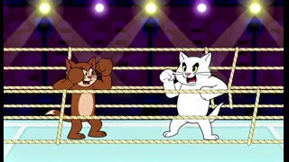
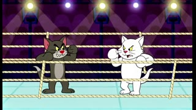
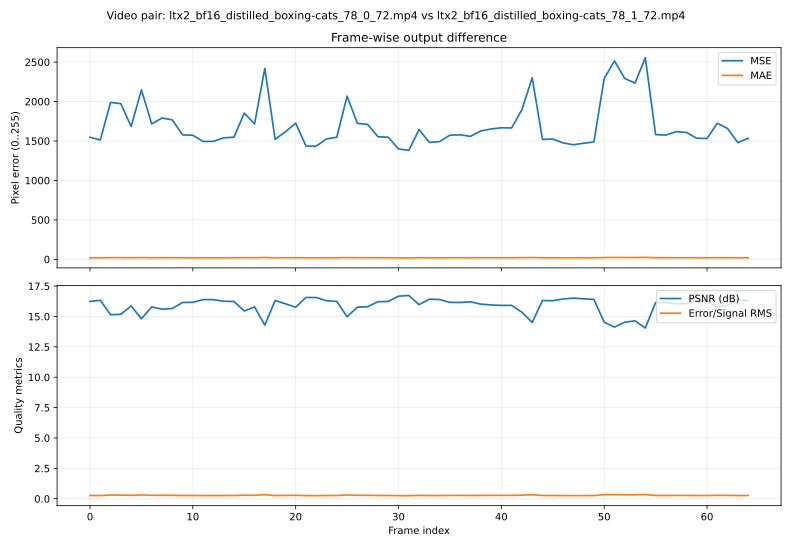

# Notes

This document describes kernel behavior, with focus on:

- autotuning and persistence behavior
- empirical checks from LTX-Video 0.9.8 13B and LTX-2 integrations

Hardware used for empirical checks in this document:

- `NVIDIA H200` (`143771 MiB`)
- driver / CUDA: `590.48.01` / `13.1`

## Kernel overview

The fused forward computes:

`y = (x @ B^T @ A^T) + (x @ Q^T) + bias`

Status note:

- `fused_forward` is currently a fused API entrypoint, but not a single fully fused kernel implementation end-to-end.
- Full end-to-end fusion remains on the roadmap and is the immediate next optimization target.

## Autotune

### What is tuned

kernel tunes cuBLASLt heuristic indices

Each plan is keyed by device and shape metadata, then cached in-memory for process lifetime.

### Selection flow

For each new key:

1. Query cuBLASLt heuristic candidates (`cublasLtMatmulAlgoGetHeuristic`).
2. Try loading a persisted candidate index from disk cache.
3. If missing/invalid, benchmark candidates and select the fastest valid one.
4. Fall back to first successful heuristic if benchmarking is skipped/unavailable.
5. Store selected candidate index in persistent cache.

Benchmarking uses:

- `CUBLASLT_AUTOTUNE_WARMUP` (default `2`)
- `CUBLASLT_AUTOTUNE_ITERS` (default `100`)

### Persistent cache behavior

Persistent cache is always enabled in v13.

- Cache file location resolution:
  1. `CUBLASLT_AUTOTUNE_CACHE_FILE`
  2. `${LITELINEAR_CACHE}/autotune_v13.cache`
  3. `${HF_HOME}/litelinear_cache/autotune_v13.cache`
  4. `${HOME}/.cache/litelinear_cache/autotune_v13.cache`

### Force re-autotune

```bash
export CUBLASLT_AUTOTUNE_RESET=1
```

Effect:

- Persisted lookups are bypassed.
- Kernel re-profiles and picks fresh algorithms.
- New picks are still persisted.

Default is off (`CUBLASLT_AUTOTUNE_RESET=0`).

### Autotune knobs

- `CUBLASLT_AUTOTUNE_WARMUP` (default `2`)
- `CUBLASLT_AUTOTUNE_ITERS` (default `100`)
- `CUBLASLT_AUTOTUNE_VERBOSE` (default `0`, `1/2` for logs)
- `CUBLASLT_HEURISTIC_COUNT` (default `8`, clamped to `1..32`)

## Example pair + noise growth

Two example outputs (local copies under `docs/assets`). Click a thumbnail to play:

| baseline (`nn.Linear`) | LiteLinear (`LiteLinear`) |
| --- | --- |
| [](assets/ltx2_bf16_distilled_boxing-cats_78_0_72.mp4) | [](assets/ltx2_bf16_distilled_boxing-cats_78_1_72.mp4) |

Artifacts:

- chart: 

### Why visual quality can stay almost unchanged

Pixel-wise metrics are strict and can overstate perceptual drift for generative videos. In practice:

- no black frames appear in either example output
- frame-level error trend is approximately flat (no runaway growth)
- global brightness/contrast statistics between outputs remain close

## Practical notes

- First-time shape hits can be slower due to autotune.
- Stable benchmark runs should warm up expected shapes before timing totals.
- If hardware/driver changes, run once with `CUBLASLT_AUTOTUNE_RESET=1` to refresh cache.
- Near-term roadmap: move from staged execution toward fuller fusion to reduce launch overhead and memory traffic.
